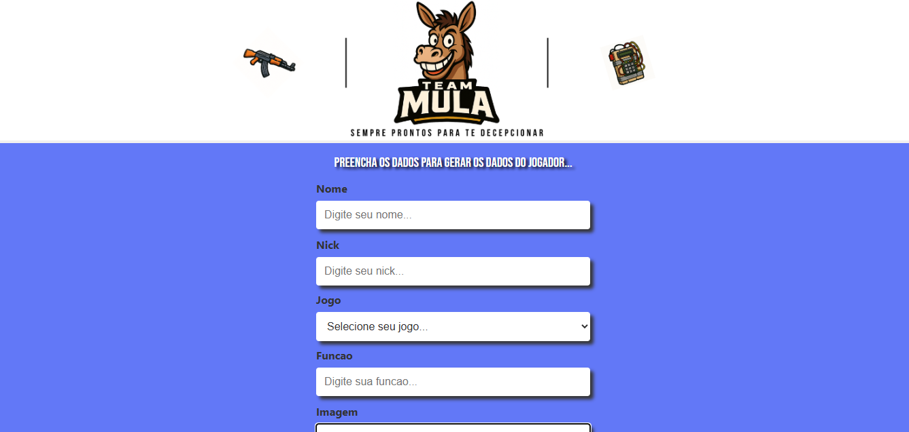

# Documentação Técnica do Projeto: Team Mula – Protótipo de Website

---

## 1. Introdução

Este documento descreve a estrutura técnica do projeto **Team Mula**, um protótipo de website desenvolvido como estudo prático de tecnologias web modernas. O projeto encontra-se **em andamento** e não está finalizado, estando sujeito a ajustes estruturais e visuais à medida que novas funcionalidades são incorporadas.

---

## 2. Interface do Usuário (UI)

<p align="center">
  
</p>


---

### 2.1 Interface dos Cards Gerados

<p align="center">
  
</p>


---

## 3. Objetivo Geral

O objetivo do projeto é aplicar conhecimentos teóricos em um ambiente prático, desenvolvendo a estrutura inicial de um website com foco em **componentização**, **responsividade** e **boas práticas de desenvolvimento front-end**, utilizando tecnologias amplamente adotadas no mercado.

---

## 4. Tecnologias e Ferramentas Utilizadas

| Tecnologia/Ferramenta | Finalidade |
| --- | --- |
| **HTML5** | Marcação semântica do conteúdo |
| **CSS3** | Estilização visual do layout |
| **JavaScript (ES6+)** | Lógica da aplicação e manipulação de eventos |
| **React.js** | Criação de interfaces reutilizáveis e reativas |
| **Node.js / npm** | Ambiente de execução e gerenciamento de pacotes |
| **Create React App** | Inicialização rápida do projeto com configuração padrão |

---

## 5. Estrutura do Projeto

A arquitetura do repositório segue o padrão criado pelo `Create React App`, promovendo organização e escalabilidade:

```
team-mula-site-react-norelease/
├── public/
│   └── index.html          
├── src/
│   ├── components/        
│   ├── App.js             
│   └── index.js            
├── package.json            
├── README.md               
└── .gitignore           

```

---

## 6. Instalação e Execução Local

### 6.1. Pré-requisitos

- **Node.js** (versão 16 ou superior)
- **npm** ou **yarn**

### 6.2. Passos para execução

```bash
# Clonar o repositório
git clone https://github.com/duarteHiago/team-mula-site-react-norelease.git
```

## 6.2.1 Instalar Dependências

```bash
npm install
```

## 6.2.2 Iniciar o Servidor de Desenvolvimento

```bash
npm start
```

Após isso, o projeto estará disponível em `http://localhost:3000`.

---

## 7. Considerações Finais

O projeto **Team Mula** é parte de um processo de aprendizado contínuo e tem **caráter exclusivamente educacional**. Ele está em fase inicial de desenvolvimento e será progressivamente expandido com novas funcionalidades, melhorias visuais e práticas modernas de engenharia de software.

Esta documentação será atualizada à medida que o projeto evoluir.
